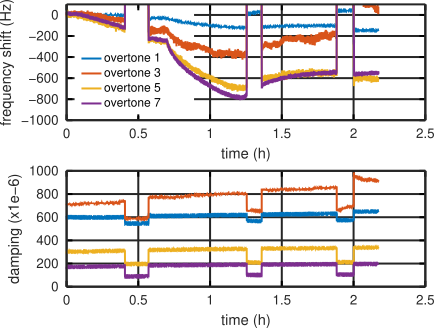
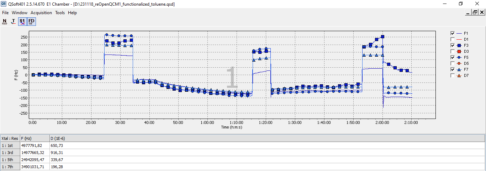

# Reading Q-Sense's QSoft QSD file from GNU/Octave

Reverse engineering QSD file format to read time, frequency and damping
and display in GNU/Octave. Results seem consistent with the screenshot
grabbed during acquisition by the proprietary QSoft 401 software.

GNU/Octave output:

QSoft 401 acquisition:

Notice that QSoft 401 displays df(N)/N with N the overtone number, consistent
with Sauerbrey mass sensitivity assuming a ridig film. This seems however
to contradict the [manual](https://warwick.ac.uk/fac/cross_fac/sciencecity/programmes/internal/themes/am2/booking/qcm/e1_operator_manual_-_download_version.pdf)
stating (page 49) that "The frequency "drifts" then follow the mass sensitivities of
the overtones, i.e., the shifts in frequency goes as 1:3:5:7... for the fundamental 
and the 3rd, 5th, and 7th overtones and so on."
