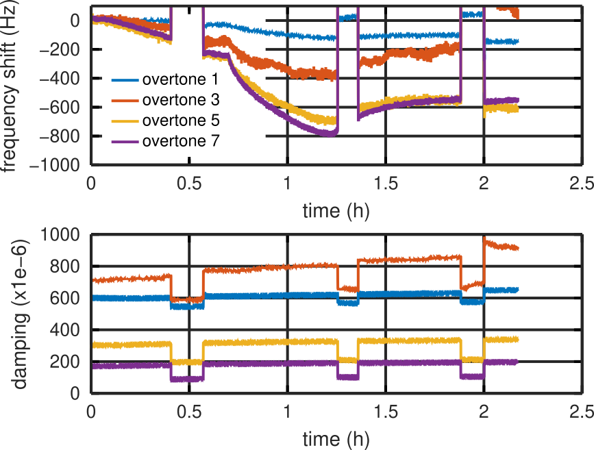

# Reading Q-Sense's QSoft QSD file from GNU/Octave

Reverse engineering QSD file format to read time, frequency and damping
and display in GNU/Octave. Results seem consistent with the screenshot
grabbed during acquisition by the proprietary QSoft 401 software.

GNU/Octave output:

QSoft 401 acquisition:

Notice that QSoft 401 displays df(N)/N with N the overtone number.
