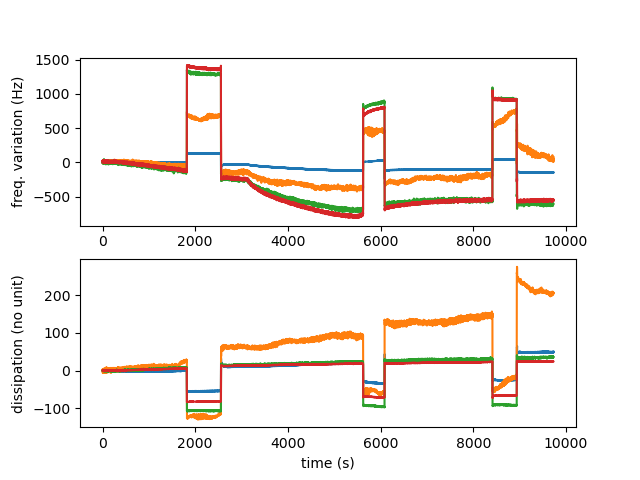

# Reading Q-Sense's QSoft QSD file from GNU/Octave

Reverse engineering QSD file format to read time, frequency and damping
and display in GNU/Octave. Results seem consistent with the screenshot
grabbed during acquisition by the proprietary QSoft 401 software.

## Running

The ``goall.m`` script is designed to be executed with GNU/Octave (tested
with version 8.4.0 under GNU/Linux) but should run quite immediately with
Matlab (removing ``graphics_toolkit('gnuplot');`` should be all that is needed,
not tested) and demonstates the use of ``read_qsd.m`` for reading all QSD files
in the current directory.

Since Octave requires all lines and columns of the returned matrices to be the 
same size, some columns of the matrices with time, frequency or damping records
might end up with trailing 0s. Use the fourth argument "dataset length" to only
analyze the relevant values and omit the trailing 0s in each column.

## Result

GNU/Octave output:

QSoft 401 acquisition:

Notice that QSoft 401 displays df(N)/N with N the overtone number, consistent
with Sauerbrey mass sensitivity assuming a ridig film. This seems however
to contradict the 
[manual](https://warwick.ac.uk/fac/cross_fac/sciencecity/programmes/internal/themes/am2/booking/qcm/e1_operator_manual_-_download_version.pdf)
stating (page 49) that "The frequency "drifts" then follow the mass sensitivities of
the overtones, i.e., the shifts in frequency goes as 1:3:5:7... for the fundamental 
and the 3rd, 5th, and 7th overtones and so on." but has been confirmed by Biolin/Quantum Design
support.

## Python port

I have no clue about Python programming, so the initial guess was to ask PizzaGPT for a
draft of Python syntax by feeding the original Octave code, and debug step by step the 
proposed output program (which of course was not even syntaxically correct, but at least 
provided some of the useful functions) until the same intermediate variables would match
those of the Octave code. The <a href="read_qsd.py">resulting program</a> 
might be far from optimal and depends on Numpy to closely match Octave array handling, 
but at least provides a functional demonstration on available sample files. Use at your 
own risks!

Execute with ``python3 read_qsd.py`` from a GNU/Linux terminal, tested with Python 3.11.6.

All decoding software verified with <a href="https://www.biolinscientific.com/qsense/instrument/qsense-explorer">single-sensor</a> and <a href="https://www.biolinscientific.com/qsense/instruments/qsense-analyzer">quad-sensor</a> instrument records.
